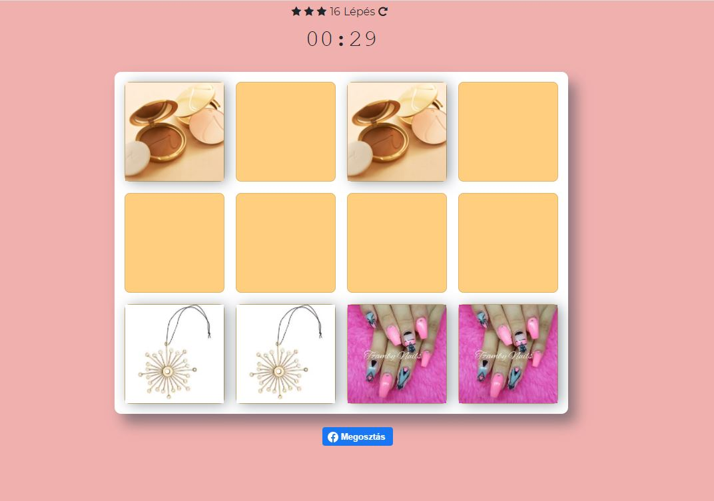

# Memory Game

## General Info

Memory game and registration form that saves the data to a google sheet by calling an external api. This is an embeddable javascript code.

## Screenhots



## Technolgies

+ Vanilla JS
+ Bootstrap 4.2.1
+ sweetalert 2 3.0.3
+ JQuery 3.3.1
+ api.apispreadsheets.com

## Setup

To run this project, install it locally using [xampp](https://www.apachefriends.org/hu/index.html) on Windows. On Linux use command
```
chmod 755 xampp-linux-*-installer.run
```
and install it with
```
sudo ./xampp-linux-*-installer.run
```

or just copy at all on your code playground (e.g. [jsfiddle](https://jsfiddle.net/)).

## Enviroment

In a test environment, data is not sent to the api.

## Created

2020

## License

Ringier Axel Springer
